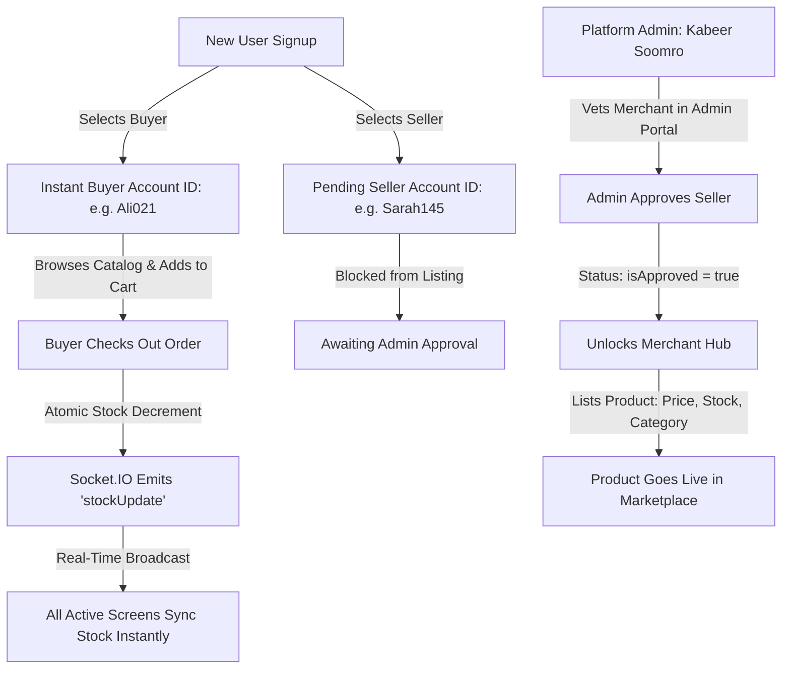

<div align="center">

# 💎 LUXE — Real-Time Multi-Vendor Luxury E-Commerce Platform

**Next-Generation E-Commerce Architecture with Real-Time WebSocket Synchronization, Multi-Role Governance & Glassmorphic Precision.**

<p align="center">
  <i>Engineered with high performance, role-based workflows, live inventory pulses, and a luxury aesthetic as part of the CodeAlpha Internship.</i>
</p>

<!-- 4 Primary Action Badges (No Duplicate Live Demo Buttons Anywhere Else) -->
<p align="center">
  <a href="https://code-alpha-luxe-ecommerce.vercel.app" target="_blank">
    
  </a>
  <a href="https://www.youtube.com/@KabeerSoomro" target="_blank">
    
  </a>
  <a href="https://www.linkedin.com/in/kabir-soomro" target="_blank">
    
  </a>
  <a href="https://www.linkedin.com/in/kabir-soomro" target="_blank">
    
  </a>
</p>

<!-- Technology Stack Badges -->
<p align="center">
  
  
  
  
  
  
  
  
  
  
</p>

</div>

---

## 🌟 Executive Overview

**LUXE** is an enterprise-grade, real-time multi-vendor e-commerce platform designed specifically for high-end luxury products. Built from the ground up with **React 18, Vite, Tailwind CSS, Node.js, Express, MongoDB Atlas, and Socket.IO**, the platform delivers a sovereign digital shopping experience.

Unlike conventional e-commerce templates with mock static data, **LUXE operates as a true live marketplace**:
1. **Empty-State Live Catalog:** Default demo products and auto-seeders have been decoupled so the marketplace only reflects active pieces curated and listed by verified merchants.
2. **Admin Verification Gatekeeper:** New sellers can register with custom boutique credentials, but are securely held in an exclusivity queue until manually vetted and approved by the Platform Administrator.
3. **Smart Concierge Account IDs:** Every user (Admin, Seller, Buyer) is assigned a custom, memorable Account ID algorithmically generated from their name plus a 2–3 digit suffix (e.g., `Ali021`, `Kabeer309`).
4. **Bi-Directional WebSocket Sync:** Stock changes upon customer checkout are broadcast instantaneously across all connected clients via Socket.IO without page refreshes.

---

## 🏛️ System Architecture & Real-Time Flow

```
┌─────────────────┐       HTTP / REST (JWT)       ┌────────────────────────┐
│  React 18 SPA   ├──────────────────────────────►│   Express.js Backend   │
│   (Vite Build)  │◄──────────────────────────────┤  (Node.js + Controllers)│
└────────┬────────┘                               └───────────┬────────────┘
         │                                                    │
         │ WebSocket Events (`stockUpdate`)                   │ Mongoose ODM
         ▼                                                    ▼
┌─────────────────┐       Live Stock Broadcast     ┌────────────────────────┐
│ Socket.IO Client│◄──────────────────────────────┤  MongoDB Atlas Cluster │
│ (Global Context)│                               │ (Atomic $inc & Filters)│
└─────────────────┘                               └────────────────────────┘
```

### Dynamic Multi-Role Lifecycle:


---

## 👑 Role Governance & Ecosystem

| Role | Access Level | Responsibilities & Capabilities |
| :--- | :--- | :--- |
| **Super Admin** | Full System Governance | • Complete overview of gross revenue, total orders, users, and catalog.<br/>• **Seller Verification Vault:** Review boutique credentials, approve or revoke merchant privileges.<br/>• Direct product and order status modification (`Pending`, `Processing`, `Delivered`). |
| **Approved Seller** | Merchant Hub Access | • Dedicated Boutique dashboard (`/seller`).<br/>• Create, update, and manage exclusive luxury products with high-res imagery.<br/>• Real-time stock management and boutique performance metrics. |
| **Pending Seller** | Restricted Merchant | • Can access profile and dashboard in read-only status.<br/>• Protected by server-side middleware (`403 Forbidden`) until Admin grants approval. |
| **Buyer / Customer** | Private Client | • Interactive luxury shopping catalog with price/category filters & real-time search.<br/>• Persistent shopping cart with stock-boundary protection.<br/>• One-click order placement and detailed order history with tracking timeline. |

---

## ⚡ Key Architectural Techniques & Engineering Highlights

### 1. Smart Concierge Account ID Generation
Users receive a memorable, clean Account ID that matches their legal/display name plus 2 to 3 digits (e.g., `Ali021`, `Kabeer309`).
* **Clean String Normalization:** Strips special characters, capitalizes the root name.
* **Collision-Resistant Randomization:** Loops through candidate suffixes with MongoDB uniqueness validation.
* **Ubiquitous Presentation:** Rendered in the top navigation bar, client profile card, merchant hub, and admin management tables.

### 2. Zero-Latency Real-Time Inventory (Socket.IO)
When an order is successfully confirmed:
* MongoDB atomically decrements `countInStock` using `{ $inc: { countInStock: -qty } }`.
* Express server emits a `stockUpdate` event containing `{ productId, countInStock }`.
* React `SocketContext` captures the event and immediately reflects new inventory numbers and out-of-stock badges on all open screens across devices without requiring reload.

### 3. Glassmorphic UI & Adaptive Theming
* **Frosted Glass Design System:** Crafted with layered backdrop filters (`backdrop-blur-xl`), subtle gold gradients, translucent borders, and custom typography (`Playfair Display` + `Plus Jakarta Sans`).
* **Dark / Light Mode Toggle:** Seamless switching powered by CSS custom properties with instant DOM synchronization and `localStorage` persistence.
* **Micro-Animations:** Hover transitions, pulsating approval indicators, and responsive card staggering.

### 4. Robust Security & Authorization Middleware
* **JWT Token Verification:** Bearer token authentication safeguarding private routes.
* **Granular Role-Based Access Control (RBAC):** `protect`, `admin`, `approvedSeller`, and `adminOrApprovedSeller` middleware tiers.
* **Safe Credential Handling:** Password hashing via `bcryptjs`, case-insensitive email matching (`RegExp`), input trimming, and interactive show/hide password toggles.

---

## 📂 Project Directory Structure

```text
luxe_ecommerce/
├── backend/
│   ├── config/
│   │   └── db.js                 # MongoDB Atlas connection & startup lifecycle
│   ├── controllers/
│   │   ├── adminController.js    # Metrics, orders, and seller approval workflows
│   │   ├── authController.js     # Register, login, profile, and Account ID logic
│   │   ├── orderController.js    # Order checkout & atomic stock decrement
│   │   └── productController.js  # Catalog search, filtering, and CRUD operations
│   ├── middleware/
│   │   └── authMiddleware.js     # JWT guard & RBAC authorization gates
│   ├── models/
│   │   ├── Order.js              # Order schema with orderItems & payment status
│   │   ├── Product.js            # Luxury product schema with seller reference
│   │   └── User.js               # User schema with roles, accountId & approval flags
│   ├── routes/
│   │   ├── adminRoutes.js        # Admin endpoints
│   │   ├── authRoutes.js         # Auth & profile endpoints
│   │   ├── orderRoutes.js        # Order endpoints
│   │   └── productRoutes.js      # Product endpoints
│   ├── seeder.js                 # Database configuration & admin initializer
│   └── server.js                 # Express app + HTTP Socket.IO server
│
├── frontend/
│   ├── src/
│   │   ├── components/
│   │   │   ├── AdminDashboard.jsx  # Admin portal & seller approval vault
│   │   │   ├── AuthModal.jsx       # Login/Register with password visibility
│   │   │   ├── CartDrawer.jsx      # Slide-out glassmorphic cart drawer
│   │   │   ├── CustomerProfile.jsx # Client portfolio, Account ID & order history
│   │   │   ├── Navbar.jsx          # Adaptive header with status pills & navigation
│   │   │   ├── ProductCard.jsx     # Card with live stock badges & price format
│   │   │   ├── ProductDetailModal.jsx # Comprehensive piece inspection modal
│   │   │   └── SellerDashboard.jsx # Merchant Hub for product listing & edits
│   │   ├── context/
│   │   │   ├── AuthContext.jsx     # User authentication state & token caching
│   │   │   ├── CartContext.jsx     # Cart state, quantities & local persistence
│   │   │   ├── SocketContext.jsx   # Live WebSocket connection & stock overrides
│   │   │   └── ThemeContext.jsx    # Dark/Light theme mode controller
│   │   ├── services/
│   │   │   └── api.js              # Axios-free standardized fetch abstraction
│   │   ├── App.jsx                 # Main application view coordinator
│   │   ├── index.css               # Design tokens & glassmorphic utility classes
│   │   └── main.jsx                # React root mount
│   ├── index.html                  # HTML entry with luxury typography CDN
│   ├── tailwind.config.js          # Custom luxury color palette & fonts
│   └── vite.config.js              # Vite bundler configuration
│
└── README.md                       # Comprehensive platform documentation
```

---

## 📡 RESTful API Reference

### Authentication & Users (`/api/auth`)
| Method | Endpoint | Access | Description |
| :--- | :--- | :--- | :--- |
| `POST` | `/api/auth/register` | Public | Register new Buyer or Seller; generates matching `accountId` |
| `POST` | `/api/auth/login` | Public | Authenticate user credentials and return JWT |
| `GET` | `/api/auth/profile` | Private | Retrieve authenticated user profile with `accountId` |

### Products & Inventory (`/api/products`)
| Method | Endpoint | Access | Description |
| :--- | :--- | :--- | :--- |
| `GET` | `/api/products` | Public | Fetch catalog with keyword search, category filter, and sorting |
| `GET` | `/api/products/:id` | Public | Fetch single product details populated with seller name |
| `POST` | `/api/products` | Admin / Approved Seller | Create and list a new luxury item in the catalog |
| `GET` | `/api/products/my-products` | Approved Seller | Fetch products owned by the authenticated merchant |
| `PUT` | `/api/products/:id` | Admin / Approved Seller | Update product details, price, or stock |
| `DELETE` | `/api/products/:id` | Admin / Approved Seller | Remove product from marketplace |

### Seller Governance & Admin Portal (`/api/admin`)
| Method | Endpoint | Access | Description |
| :--- | :--- | :--- | :--- |
| `GET` | `/api/admin/metrics` | Admin | Aggregate system metrics (revenue, orders, inventory) |
| `GET` | `/api/admin/sellers` | Admin | List all registered sellers with approval status & `accountId` |
| `PUT` | `/api/admin/sellers/:id/approve` | Admin | Approve seller application to unlock product listing |
| `PUT` | `/api/admin/sellers/:id/reject` | Admin | Revoke or reject seller merchant privileges |
| `GET` | `/api/admin/orders` | Admin | View all platform orders |

### Orders & Real-Time Checkout (`/api/orders`)
| Method | Endpoint | Access | Description |
| :--- | :--- | :--- | :--- |
| `POST` | `/api/orders` | Private | Place order; atomic stock decrement & `stockUpdate` emission |
| `GET` | `/api/orders/myorders` | Private | Retrieve order history for current customer |
| `PUT` | `/api/orders/:id/deliver` | Admin | Mark order fulfillment status as Delivered |

---

## 🛠️ Local Installation & Setup

### Prerequisites
* **Node.js** v18 or higher (v20+ recommended)
* **MongoDB Atlas** account or local MongoDB instance
* **Git** installed on your system

### 1. Clone the Repository
```bash
git clone https://github.com/KabirSoomro/luxe-ecommerce.git
cd luxe-ecommerce
```

### 2. Backend Setup & Environment Configuration
```bash
cd backend
npm install
```

Create a `.env` file in the `backend/` directory:
```env
PORT=5000
NODE_ENV=development
MONGO_URI=your_mongodb_atlas_connection_string
JWT_SECRET=your_jwt_secret_key
ADMIN_NAME="Kabeer Soomro"
ADMIN_EMAIL=kksoomro@gmail.com
ADMIN_PASSWORD=your_admin_password
```

Start the backend server:
```bash
npm run dev
# Server will run on http://localhost:5000
```

### 3. Frontend Setup
In a new terminal window:
```bash
cd frontend
npm install
npm run dev
# Frontend will run on http://localhost:5173
```

---

## 🚀 Deployment

* **Frontend:** Optimized for zero-config static deployment on [Vercel](https://vercel.com). The production build outputs directly to `frontend/dist`.
* **Backend:** Ready for deployment on [Render](https://render.com) or [Railway](https://railway.app) with automatic WebSocket handling through Node's `http.createServer(app)`.

---

## 👤 Author & Acknowledgments

* **Developer:** **Kabeer Soomro**
* **Role:** Full-Stack Developer & Software Engineering Intern
* **Organization:** **CodeAlpha**
* **Project Track:** Premium E-Commerce Platform Enhancement & Real-Time Rebuild

---

<div align="center">
  <sub>Designed and built with luxury craft by Kabeer Soomro for CodeAlpha. All rights reserved.</sub>
</div>
